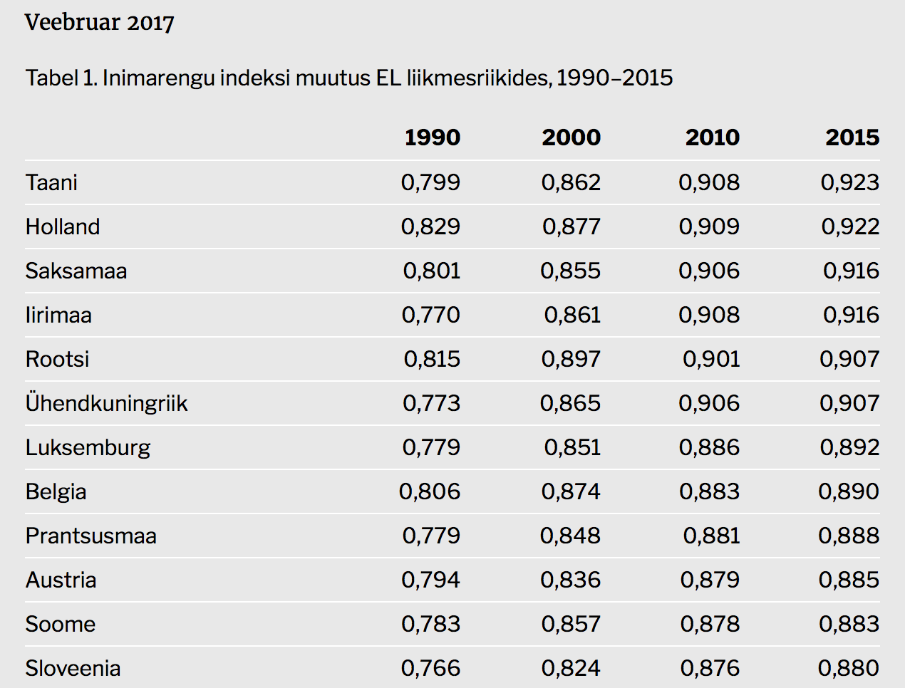

```{r setup, include=FALSE}
knitr::opts_chunk$set(message = F)
```


Esimesel juunil 2017 avaldatud Eesti inimarengu aruandes [Eesti rändeajastul](http://inimareng.ee/pohisonumid-eesti-randeajastul/) tuuakse välja, et Eesti inimarengu indeks on aastatel 1990–2015 teinud läbi märkimisväärse tõusu. 
Uutest Euroopa Liiduga (EU) liitujatest on Eesti oma indeksi kasvuga saavutanud auväärse kolmanda koha Sloveenias ja Tšehhi Vabariigi järel.

Kahjuks on selle väite toetuseks toodud andmed esitatud ainult tabeli kujul.
Eesti edu visuaalseks toetuseks oleks pidanud esitama võrreldavate riikide inimarengu indeksi kasvukõverad.
Puhtalt tabelit vaadates ei ole võimalik seda väidet lihtsal viisil kontrollida.
Põhimõtteliselt on võimalik võrrelda riikide numberid aastate kaupa tulbas, kuid kasvu võrdlemine nõuab juba arvutamist.
Kasvukõvera tõusu oleks aga ilma arvutamata võimalik hinnata visuaalselt. 
Proovime siis luua selle puuduva visuaali. 

```{r, echo=FALSE, fig.align='left', fig.cap="Inimarengu indeksi 1990-2015 tabeli pea. @aruanne2017"}

```


Kõigepealt laeme raporti koduleheküljelt alla jutuks oleva tabeli andmetega.
Paradoksaalsel kombel on nende andmete esitamine tabeli kujul hea just kättesaadavuse seisukohalt.
Andmete kaevamiseks kasutame `R` programmi paketi `rvest` funktsioone 

```{r andmed}
library(tidyverse)
library(rvest)

url <- "http://inimareng.ee/pohisonumid-eesti-randeajastul/" # link raportile
page <- read_html(url) # laadime alla põhisõnumite artikli
inimareng <- html_table(page, dec = ",")[[1]] # tabel alla laaditud lehelt
colnames(inimareng)[1] <- "Riik" # esimesel tulbal puududb pealkiri
inimareng <- gather(inimareng, Aasta, indeks, -Riik) # viime andmed pikka formaati
head(inimareng) # tabeli pea
```

Esimene versioon inimarengu indeksi kasvukõveratest ongi valmis. Riigid on järjestatud tähestikulises järjekorras. Kas Eesti kasv torkab silma?
```{r}
ggplot(inimareng, aes(Aasta, indeks, group=1)) +
  geom_line() +
  facet_wrap(~Riik, ncol = 7) +
  theme(axis.text.x = element_text(angle=45, hjust = 1)) +
  ylab("Inimarengu indeks")
```


Arvutame siis kasvu ja järjestame riigid selle põhjal. Kuna puuduvad paralleeluniversumid, siis on igal riigil on iga ajaperioodi kohta ainult üks väärtus ja kasvu iseloomustamiseks piisaks lihtsalt ainult esimese ja viimase ajaperioodi vahe arvutamiseks. Meie aga arvutame lieaarse mudeli tõusu, kuigi need kõverad on kohati ilmselgelt mittelineaarsed. Me teeme muutuja `Aasta` numbriliseks `mutate_at("Aasta", as.numeric)`, muidu saaksimegi ainult vahe aastaga 1990 võrreldes. Kui me võtame aastad numbrilise muutujana, siis ei oma lõikepunkt tähendust ja me vaatame ainult mudeli tõusu. `broom::tidy` funktsioon konverteerib `lm` funktsiooni väljundi mugavalt käitletavaks andmeraamiks.
```{r}
library(broom) # tidy funktsioon
kasv <- inimareng %>% 
  mutate_at("Aasta", as.numeric) %>% 
  split(.$Riik) %>% 
  map_df(~tidy(lm(indeks~Aasta, .x)), .id="Riik") %>% 
  filter(term=="Aasta") %>% # vaatame ainult tõusu
  arrange(estimate)
head(kasv)
```

Järjestame riigid mudeli tõusu järgi.
```{r}
ia_kasv <- left_join(inimareng, kasv, "Riik")
riik_jrk <- select(ia_kasv, Riik, estimate) %>% 
  distinct() %>% 
  arrange(desc(estimate))
ia_kasv$Riik_kasv <- factor(ia_kasv$Riik, levels = riik_jrk$Riik)
```

Siin ongi EU riigid järjestatuna inimarengu indeksi kasvu järgi. Eesti on Läti järel neljandal kohal. Läti on teinud tubli kasvu, Eesti asub indeksis 2015 seisuga siiski kõrgemal. Võrreldes naabrite, Läti ja Leeduga, on Eesti kasv olnud ühtlasem ja ei ole viimase viie aasta jooksul nii palju takerdunud.
```{r}
ggplot(ia_kasv, aes(Aasta, indeks, group=1)) +
  geom_line() +
  facet_wrap(~Riik_kasv, ncol = 7) +
  theme(axis.text.x = element_text(angle=45, hjust = 1)) +
  ylab("Inimarengu indeks")
```


Tegelikult annaks veel nokitseda, kuid kokkuvõtvalt oleks inimarengu indeksi visuaalne representatsioon aidanud kaasa Eesti võrdlusele teiste EU riikidega. Sõltumata riikide järjestamise põhimõttest. 

Selgelt on riike, mis on alustanud meie ja meie lähinaabritega samalt tasemelt, kus inimarengu indeks on teinud küll nõksu ülespoole, kuid viimasel perioodil on toimunud arengu pidurdumine, näiteks nagu Rumeenia ja Bulgaaria. Loomulikult on areng väiksem riikides, mis olid juba kõrge arengutasemega perioodi alguses, Nõukogude Liidu lagunemise ajal.

# Viited
