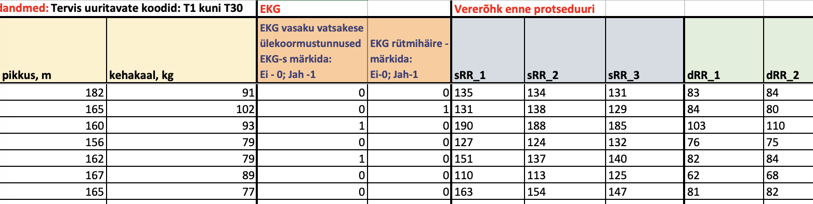

Mul on andmed Exceli tabelis, kuidas ma need sealt R keskkonda saan? 

Iseenesest on asi väga lihtne. **tidyverse** R raamatukogude alla kuulub ka Excelist andmete importimise raamatukogu, mille nimi on **readxl**.

**readxl** on lihtne pakett, selles on kaks põhilist funktsiooni ja mõned abifunktsioonid.

1. `excel_sheets` Exceli failis olevate tabelite teada saamiseks
2. `read_excel`, `read_xls` ja `read_xlsx` tabelite importimiseks. Neist kolmest funktsioonist esimene üritab ise ära arvata mis formaadis Exceli fail on ja vaikimisi impordib kõige esimese tabeli ("Sheet1"). Teised kaks eeldavad vaikimisi .xls või .xlsx formaati ja on selle võrra efektiivsemad, sest ei pea kulutama aega "mõistatamise" peale.
3. Abifunktsioonid on tabelist imporditavate piirkondade ja tulbanimede-tüüpide spetsifitseerimiseks ja enamasti oskab `read_excel` neid ise vastavalt vajadusele kasutada. 

Elu on siiski kaugel ideaalsest ja 100% masinloetavaid Exceli faile ei suuda genereerida isegi "masinad" (tarkvara). 

- Ideaalis peaksid tabelid algama Exceli *workbookides* ülevalt vasakult esimeset reast, 
- sisaldama süntaktilisi tulbanimesid (näiteks ilma tühikuteta), 
- mitte kasutama kahekordseid tulbanimesid (väga paha!),
- mitte kasutama ruutude värvimist kategooriate tähistusena, 
- olema "kandilised" ja mitte sisaldama tühje ruute (puuduvad andmed on tähistatud näiteks `NA`-ga).

Ülaltoodu kehtib üldiselt kõigi tabelite kohta.

## Install

Hakkame pihta, kõigepealt installeerime **readxl** raamatukogu. R konsoolis näeb see välja niimoodi:
```{r, eval=FALSE, message=FALSE}
install.packages("readxl", repos = "https://ftp.eenet.ee/pub/cran/")
```

See `repos =` argument on optsionaalne, kuid antud juhul laadime me selle paketi alla EENet-ist.

## Import

Kui raamatukogu on edukalt installeeritud või täiesti juhuslikult juba varasemast olemas, laadime oma töökeskkonda **readxl** raamatukogu, et selles olevad funktsioonid meile R keskonnas kättesaadavaks muutuksid. 

```{r}
library(readxl)
```

Edasi peame välja selgitama kus asuvad andmed. Käesolev blogi eeldab, et 

- kasutaja on loonud oma projekti jaoks eraldi kataloogi ning 
- projekti kataloogi sisse veel kataloogi `data/` kuhu on tõstnud oma imporditava tabeli.

Projekti nimedeks sobib hästi üks-kaks sõna, mis on eraldatud sidekriipsuga, näiteks "kursusetöö-2019".

### Lihtne import

Kõige esimene näidistabel on mpg andmeset **ggplot2** paketist failis `data/mpg.xlsx`. Siin on kõik isenesest lihtne. Oletame siiski, et me ei tea mis meil selles failis on. Seepärast vaatame kõigepealt, mis tabelid selles .xlsx formaadis failis on:
```{r}
sheets <- excel_sheets("data/mpg.xlsx")
sheets
```

Nagu näha on selles *workbookis* üks tabel nimega "Sheet1". Impordime selle kasutades `read_xlsx` funktsiooni:
```{r}
sheet1 <- read_xlsx("data/mpg.xlsx", sheet = "Sheet1")
sheet1
```

Siinkohal *sheet*idega palju keerulisemaks ei lähekski, eeldus on, et eri *sheet*idel on eri tüüpi tabelid ning need imporditakse ükshaaval omaette objektidesse. 

### Topelt tulbanimed

Järgmiseks võtab vähe keerulisema tabeli, kus on topelt pealkirjad. Inimesed armastavad topelt-tulbanimesid, sest see võimaldab oma tabelile lihtsalt lisada metaandmeid. 
Inimesed saavad aru, kuid programmid on hädas. 


Exceli puhul kasutatakse sellisel puhul sageli ruutude ühendamist või siis kehtib tulbanimi ka järgnevate ruutude kohta kuni järgmise tulbanimeni.


```{r, echo=FALSE, fig.cap="Väljavõte tüüpilisest kahekordsete tulbanimedega tabelist."}

```

Impordime kahekordsete tulbanimedega tabeli failist `data/cardio.xlsx`. Vaatame mis *sheet*id selles failis on: 
```{r}
excel_sheets("data/cardio.xlsx")
```

Ok. Meil on siin jälle ainult üks sheet. Siin kasutame näite mõttes indeksit ja loeme sisse selles failis oleva esimese ja ainukese tabeli:  

```{r}
read_xlsx("data/cardio.xlsx", sheet = 1)
```

Nagu näha tekib palju probleeme... ja tabeli esimeses reas asuvad meil hoopis tulbanimed.


Jätame esimese rea vahele.
```{r}
read_xlsx("data/cardio.xlsx", sheet = 1, skip = 1)
```

Parem, kuid nüüd on puudu osa metaandmeid ja üldiselt võib tekkida probleem ka sarnaste tulbanimedega. Nagu näha lisab `read_xlsx` vaikimisi topelt nimedele kolm punkti ja tulba indeksi, näiteks "...3".

Siin on mitmeid võimalusi kuidas seda probleemi lahendada. Võime proovida importida ainult need read mis sisaldavad tulbanimesid ja need kokku pasteerida.
```{r}
column_names <- read_xlsx("data/cardio.xlsx", sheet = 1, col_names = FALSE, n_max = 2)
```

Konverteerime `tibble` read vektoriteks:
```{r}
groups <- unlist(column_names[1,], use.names = FALSE)
groups
vars <- unlist(column_names[2,], use.names = FALSE)
```


Me peame `NA`-d selles vektoris asendama vastavate väärtustega. Kasutame selleks `rep()` funktsiooni. Seal on võimalik vektori igale liikmele anda oma korduste arvu. 

Arvutamegi korduste arvu (ei pea süvenema):
```{r}
repeats <- diff(c(which(!is.na(groups)), length(groups) + 1))
repeats
```

EKG-d tuleb korrata kaks korda ja teisi kuus korda.


Võtame nüüd oma mitte-NA tulbanimed ja kordame neid:

```{r}
groups_fixed <- rep(groups[!is.na(groups)], repeats)
groups_fixed
```

Selle osa jätame nüüd ootele ja vaatame, mis nende teiste tulbanimedega teha annab.


Peale sõna "märkida" tuleb esimesel kahel tulbal koodide kirjeldus, eemaldame selle osa.

```{r}
library(stringr)
vars <- str_replace(vars, "^(.+)-s? märkida: \\r\\n.+", "\\1")
vars <- str_trim(vars)
vars
```

Pasteerime need kaks tulbanimedega vektorit kokku ja asendame kõik tühikud alakriipsudega:
```{r}
vars_fixed <- str_c(groups_fixed, vars, sep = " ")
vars_fixed <- str_replace_all(vars_fixed, "\\s+", "_")
vars_fixed
```

Nüüd on meil unikaalsed tulbanimed, mida saaksime vajadusel kasutada, kuigi nad pole ideaalsed. 

Näiteks on sõna "EKG" kahes korduses ja tulbanimed sisaldavad ikka veel metaandmeid: enne/pärast, vererõhk, sRR/dRR, korduste numbrid. Aga las ta olla praegu.


Impordime uuesti andmed, kuid seekord nii, et jätame kaks esimest rida vahele ja ilma tulbanimedeta ning lisame need korrigeeritud tulbanimed "käsitsi":
```{r}
cardio <- read_xlsx("data/cardio.xlsx", sheet = 1, skip = 2, col_names = FALSE)
colnames(cardio) <- vars_fixed
cardio
```

Tulemuseks on juba töökorras tabel, millel küll antud juhul vajavad osad tulbanimed siiski edasist parandamist sest on näiteks muuseas ka liiga pikad, et nendega mugav töötada oleks.


Igaljuhul on jama palju nende kahe- või mitmekordsete tulbanimedega. Seepärast tasuks andmete importimise peale mõelda juba andmeid sisestama hakates.
